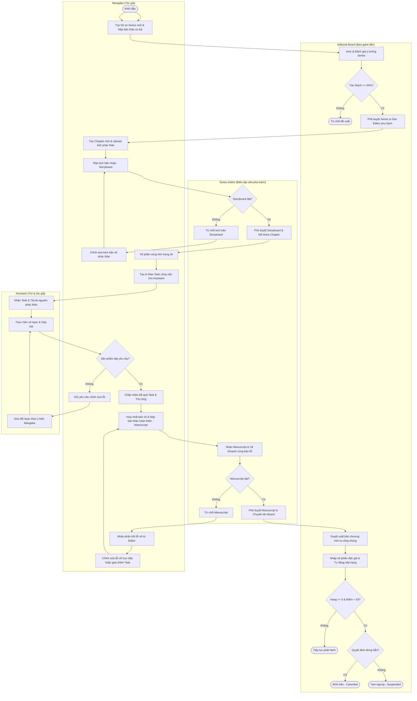

# Hệ Thống Quản Lý Quy Trình Sáng Tác & Xuất Bản Manga
> **Manga Creation Workflow and Publishing Management System**

[](https://www.php.net/)
[](https://www.mysql.com/)
[](#)
[](https://getbootstrap.com/)
[](https://opensource.org/licenses/MIT)

Hệ thống quản lý quy trình sáng tác và xuất bản Manga là một ứng dụng Web được thiết kế chuyên biệt để số hóa và tối ưu hóa toàn bộ luồng công việc trong một Studio sản xuất truyện tranh chuyên nghiệp. Dự án giải quyết bài toán phối hợp liên lạc giữa 5 chủ thể cốt lõi: **Họa sĩ (Mangaka)**, **Trợ lý (Assistant)**, **Biên tập viên (Tantou Editor)**, **Hội đồng Biên tập (Editorial Board)** và **Quản trị viên (Admin)**.

---

## 1. Các Tính Năng Cốt Lõi Theo Vai Trò (Multi-role Features)

Hệ thống cung cấp không gian làm việc chuyên biệt cho từng tác nhân với phân quyền chặt chẽ (Role-Based Access Control):

### 1.1. Tác Giả (Mangaka)
* **Quản lý Series & Chapter:** Đăng ký tác phẩm mới, tạo các chương mới và quản lý vòng đời bản thảo.
* **Page Segmentation (Chia phân vùng trang vẽ):** Chia bản vẽ thành các phân vùng hình chữ nhật trực quan để phân công.
* **Giao việc cho Trợ lý:** Phân công các nhiệm vụ vẽ chi tiết (vẽ nền, tô bóng, đi nét, chèn hiệu ứng âm thanh...) cho từng Assistant kèm theo mức thù lao cụ thể.
* **Kiểm duyệt bài nộp:** Chấm điểm, nhận xét và phê duyệt (Approve) hoặc yêu cầu làm lại (Reject) các bản vẽ trợ lý nộp lên.

### 1.2. Trợ Lý (Assistant)
* **Nhận việc thông minh:** Xem danh sách công việc được phân công kèm theo bản vẽ gốc và khoanh vùng cụ thể.
* **Nộp sản phẩm:** Tải lên các file ảnh hoàn thiện, đi kèm ghi chú.
* **Theo dõi thù lao:** Bảng theo dõi tổng hợp tiền công và thu nhập tích lũy hàng tháng dựa trên các task đã hoàn thành và được tác giả duyệt.

### 1.3. Biên Tập Viên Phụ Trách (Tantou Editor)
* **Kiểm duyệt bản thảo chương (Chapter Submission):** Xem chi tiết Storyboard và bản thảo vẽ chì do tác giả gửi lên.
* **Báo lỗi trực quan (Visual Annotation):** Khoanh vùng khoanh lỗi trực tiếp trên trang truyện bị lỗi, để lại ghi chú chi tiết giúp tác giả dễ dàng chỉnh sửa.
* **Phê duyệt xuất bản:** Cho điểm chuyên môn (1-10) và ra quyết định phê duyệt (Approved) chuyển lên Hội đồng hoặc từ chối (Rejected) bắt vẽ lại.

### 1.4. Hội Đồng Biên Tập (Editorial Board)
* **Duyệt xuất bản Series:** Quyết định phê duyệt phát hành hoặc đình bản các bộ truyện đang phát hành.
* **Xếp hạng & Thống kê:** Nhập số phiếu bình chọn của độc giả định kỳ để hệ thống tự động sắp xếp thứ tự và tính điểm số quy chuẩn (0 - 100).
* **Cảnh báo rủi ro:** Tự động phát hiện và cảnh báo các bộ truyện có hiệu suất kém (Hạng >= 5 và Điểm số < 50) có nguy cơ bị hủy dự án.

### 1.5. Quản Trị Viên (Admin)
* **Quản trị tài khoản:** Thêm, sửa, khóa tài khoản người dùng trong hệ thống.
* **Nhật ký hệ thống (Audit Logs):** Theo dõi toàn bộ lịch sử hoạt động nhạy cảm của hệ thống phục vụ mục đích bảo mật.

---

## 2. Công Nghệ Sử Dụng (Tech Stack)

* **Backend:** PHP Thuần (PHP 8.0+) viết theo mô hình MVC, sử dụng thư viện PDO kết nối Database.
* **Database:** MySQL 8.0 (Hỗ trợ bộ mã `utf8mb4_unicode_ci` hiển thị đầy đủ tiếng Việt và ký tự đặc biệt).
* **Frontend:** HTML5, CSS3, Javascript ES6, Bootstrap 5 (Giao diện đáp ứng tốt trên máy tính & máy tính bảng), FontAwesome 5.
* **Kiến trúc:** 
  * **Front Controller Pattern:** Mọi yêu cầu được gửi và xử lý tập trung tại `index.php`.
  * **Singleton Connection Sharing:** Tối ưu hóa hiệu năng bằng cách dùng chung 1 instance kết nối PDO tĩnh (`$sharedConn`) trong mỗi vòng đời Request.

---

## 3. Quy Trình Hoạt Động Tổng Quát (General System Workflow)

Dưới đây là sơ đồ luồng hoạt động phân vai (Swimlane Diagram) tổng quát của toàn bộ hệ thống từ lúc đề xuất Series mới, sáng tác kịch bản, giao việc trợ lý, kiểm duyệt bản thảo cho đến lúc xuất bản và xếp hạng định kỳ:



---

## 4. Hướng Dẫn Cài Đặt & Khởi Chạy (Installation & Setup)

### Yêu cầu hệ thống:
* Đã cài đặt **XAMPP** (PHP 8.0+ và MySQL).

### Các bước triển khai:

#### Bước 1: Sao chép mã nguồn
Tải và giải nén toàn bộ mã nguồn dự án vào thư mục gốc của web server:
`C:\xampp\htdocs\Manga-publishing-management-system`

#### Bước 2: Khởi tạo Cơ sở dữ liệu
1. Mở **XAMPP Control Panel**, nhấn **Start** cho cả **Apache** và **MySQL**.
2. Truy cập vào phpMyAdmin qua đường dẫn: `http://localhost/phpmyadmin/`.
3. Tạo mới một cơ sở dữ liệu trống có tên: `manga_workflow` với đối chiếu (Collation) là `utf8mb4_unicode_ci`.
4. Chọn cơ sở dữ liệu `manga_workflow`, nhấn vào tab **Import** (Nhập).
5. Nhấp chọn tệp tin SQL tại đường dẫn: `database/manga_workflow.sql` trong mã nguồn và nhấn **Import** (hoặc **Go**).

#### Bước 3: Kiểm tra cấu hình kết nối Database
1. Mở file [database.php](config/database.php).
2. Kiểm tra lại thông số cổng MySQL và thông tin tài khoản:
   ```php
   private $host = 'localhost';
   private $port = '3306'; // Đổi thành 3307 nếu bạn cấu hình cổng MySQL khác trong XAMPP
   private $dbname = 'manga_workflow';
   private $username = 'root';
   private $password = ''; // Để trống mật khẩu mặc định của XAMPP
   ```

#### Bước 4: Khởi chạy và trải nghiệm Demo
Mở trình duyệt web của bạn và truy cập:
`http://localhost/Manga-publishing-management-system/`

---

## 5. Tài Khoản Kiểm Thử (Demo Accounts)

Hệ thống đi kèm dữ liệu mẫu và các tài khoản kiểm thử đã được gieo sẵn trong database. Tất cả các tài khoản đều sử dụng chung mật khẩu mặc định là: **`password123`**.

| Vai trò (Role) | Tài khoản Đăng nhập (Username) | Email liên kết | Mục đích Trải nghiệm |
| :--- | :--- | :--- | :--- |
| **Admin** | `admin_user` | `admin@example.com` | Quản lý tài khoản, thay đổi quyền hạn và xem nhật ký hoạt động hệ thống. |
| **Tác giả (Mangaka)** | `mangaka_user` | `mangaka@example.com` | Đăng ký truyện mới, vẽ phân vùng trang, giao việc trợ lý, gửi bản thảo cho biên tập viên. |
| **Trợ lý (Assistant)** | `assistant_user` | `assistant@example.com` | Xem các nhiệm vụ được tác giả giao trên bản vẽ, nộp file hoàn thiện và xem bảng lương. |
| **Biên tập viên (Editor)** | `editor_user` | `editor@example.com` | Nhận xét bản thảo, vẽ khoanh vùng báo lỗi trực quan trên trang truyện, chấm điểm chất lượng chương. |
| **Hội đồng (Board)** | `board_user` | `board@example.com` | Phê duyệt xuất bản series, lập kỳ xếp hạng tự động dựa trên phiếu bình chọn của độc giả. |

---

## 6. Cấu Trúc Thư Mục Dự Án (Folder Directory Structure)

```text
Manga-publishing-management-system/
│
├── assets/                  # File tĩnh (CSS, Javascript, CSS thư viện, Logo...)
├── config/                  # Tệp cấu hình kết nối Cơ sở dữ liệu và Base Path
├── core/                    # Lớp lõi nền tảng (Auth Middleware, Base Model, Base Controller)
├── controllers/             # Các lớp xử lý logic nghiệp vụ điều phối (MVC Controllers)
├── models/                  # Các lớp làm việc trực tiếp với CSDL (MVC Models)
├── views/                   # Giao diện hiển thị được chia theo Vai trò người dùng (MVC Views)
│   ├── admin/               # Giao diện quản trị hệ thống của Admin
│   ├── board/               # Giao diện quản lý của Editorial Board (Hội đồng biên tập)
│   ├── editor/              # Giao diện làm việc của Tantou Editor (Biên tập viên)
│   ├── mangaka/             # Không gian sáng tác của Tác giả (Mangaka)
│   ├── assistant/           # Giao diện nhận việc và tính lương của Trợ lý (Assistant)
│   └── layouts/             # Các thành phần giao diện dùng chung (Header, Footer, Navbar, Sidebar)
│
├── database/                # Script SQL manga_workflow.sql để khởi tạo CSDL ban đầu
├── uploads/                 # Lưu trữ vật lý các tệp tin tải lên (ảnh bìa, trang truyện, bản thảo ZIP)
├── index.php                # Front Controller định tuyến toàn bộ yêu cầu của hệ thống
└── README.md                # Tài liệu giới thiệu và hướng dẫn sử dụng dự án
```

> **Cơ chế phân tách rõ ràng theo Mô hình kiến trúc MVC:**
> * **Model (`models/`):** Chịu trách nhiệm trực tiếp tương tác với cơ sở dữ liệu MySQL, thực thi các truy vấn thông qua PDO và trả dữ liệu dạng mảng kết hợp.
> * **View (`views/`):** Chỉ chứa mã HTML/CSS/JS để kết xuất giao diện đồ họa cho người dùng cuối. Giao diện được phân nhóm rõ ràng theo từng vai trò nghiệp vụ để tránh chồng chéo.
> * **Controller (`controllers/`):** Nhận tham số yêu cầu (request parameters) truyền về từ `index.php`, xử lý logic nghiệp vụ, gọi Model lấy dữ liệu cần thiết và yêu cầu View thích hợp render kết quả.

---

## 7. Điểm Sáng Kỹ Thuật (Key Technical Features)

1. **Double File Verification (Bảo mật tải tệp):** Hệ thống phân tích nhị phân phần đầu tệp tin tải lên (ZIP/PDF) để nhận diện tệp thay vì chỉ dựa vào đuôi mở rộng, ngăn chặn việc tải lên shell độc hại.
2. **Dynamic Menu Sidebar (Thanh điều hướng động):** Sidebar tự động tùy biến dựa vào quyền hạn đăng ký của người dùng trong Session, đảm bảo tính bảo mật và trải nghiệm đồng nhất.
3. **Physical Orphan Cleanup (Dọn dẹp tệp tin mồ côi):** Khi bản ghi dữ liệu bị xóa hoặc cập nhật tệp tin mới, hệ thống tự động xóa tệp vật lý cũ trong thư mục `uploads/` bằng hàm `@unlink`, tránh phình dung lượng lưu trữ của máy chủ.
4. **Normalized Ranking Score (Quy chuẩn hóa xếp hạng):** Điểm số xếp hạng của truyện được tự động quy chuẩn hóa về thang điểm 100 so với tác phẩm có lượng bầu chọn cao nhất trong kỳ để đảm bảo tính khách quan.
