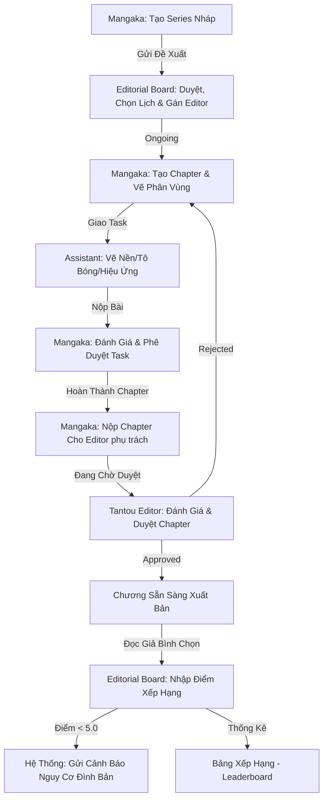

# TÀI LIỆU KỊCH BẢN LOGIC NGHIỆP VỤ & QUY TRÌNH VẬN HÀNH HỆ THỐNG MANGA PMS

Tài liệu này đặc tả chi tiết toàn bộ kịch bản nghiệp vụ, luồng hoạt động liên vai trò (End-to-End Workflow), các ràng buộc kỹ thuật nghiêm ngặt (Business Constraints) và hướng dẫn xử lý các tình huống nghiệp vụ thực tế trong hệ thống Quản lý Sáng tác và Xuất bản Manga (Manga PMS).

---

## 🧭 1. LUỒNG HOẠT ĐỘNG TOÀN CẢNH (End-to-End Workflow)

Hệ thống vận hành xoay quanh vòng đời khép kín của một tác phẩm Manga từ khi còn là ý tưởng cho đến khi phát hành và xếp hạng định kỳ. Quy trình gồm 4 giai đoạn chính:

### 🔹 Giai đoạn 1: Đăng ký & Phê duyệt Series mới
1. **Mangaka** đăng nhập hệ thống, tạo hồ sơ giới thiệu bộ truyện mới (nhập Tên truyện, Mô tả, tải lên Ảnh bìa). Lúc này bộ truyện ở trạng thái **Bản thảo nháp (`planning`)**.
2. **Mangaka** kiểm tra lại hồ sơ và nhấn **"Gửi đề xuất lên Hội đồng"**. Trạng thái bộ truyện chuyển sang **Đang chờ duyệt (`proposed`)**.
3. Thành viên **Editorial Board** đăng nhập, xem danh sách đề xuất. Board thực hiện đánh giá hồ sơ và chọn hành động:
   * **Từ chối (Reject):** Trạng thái quay về `planning` để tác giả chỉnh sửa lại.
   * **Phê duyệt (Approve):** Board bắt buộc phải chọn Lịch xuất bản là **Hàng tuần (`weekly`)** hoặc **Hàng tháng (`monthly`)**, đồng thời gán một **Biên tập viên chuyên trách (Tantou Editor)** từ danh sách để trực tiếp quản lý và duyệt các chương truyện sau này. Trạng thái bộ truyện chính thức chuyển sang **Đang xuất bản (`ongoing`)**.

### 🔹 Giai đoạn 2: Sáng tác & Phối hợp Studio (Mangaka ↔ Assistant)
1. Khi bộ truyện đã hoạt động (`ongoing`), **Mangaka** có quyền tạo mới các chương truyện (Chapter). Trạng thái khởi tạo ban đầu của Chapter là **Bản nháp (`drafting`)**.
2. **Mangaka** tải lên các trang truyện vẽ thô (Pages). Trạng thái mặc định của các trang là `sketch`.
3. Tại trang chi tiết của từng trang vẽ, **Mangaka** sử dụng chuột kéo thả trực tiếp lên tranh vẽ để tạo ra các **Phân vùng (`PageRegions`)** (Khung thoại, Nền cảnh, Nhân vật, Hiệu ứng).
4. **Mangaka** bấm nút **"Giao việc"** tại phân vùng vừa tạo, điền thông tin mô tả công việc (Task), đính kèm tệp tài nguyên vẽ hỗ trợ, chọn **Assistant** phụ trách vẽ và đặt Hạn chót (Deadline). Lúc này Task ở trạng thái **Chờ xử lý (`pending`)**.
5. Khi Mangaka đổi trạng thái Chapter từ **Bản nháp (`drafting`)** sang **Đang vẽ (`drawing`)**, **Assistant** mới bắt đầu nhận được thông báo và nhìn thấy Task trên Dashboard của mình.
6. **Assistant** tải ảnh trang vẽ và tài liệu hỗ trợ về máy, hoàn thành phần việc (ví dụ: vẽ nền cảnh) và đóng gói kết quả thành file nộp bài (ảnh hoặc file nén ZIP).
7. **Assistant** nhấn **"Nộp bài"**, tải file lên. Hệ thống tự động chuyển trạng thái Task sang **Đang xử lý/Kiểm tra (`in_progress`)** và gửi thông báo cho tác giả.

### 🔹 Giai đoạn 3: Phê duyệt bản thảo & Duyệt phát hành (Mangaka ↔ Editor)
1. **Mangaka** kiểm tra bài nộp của Assistant trực tiếp trên giao diện chi tiết trang truyện:
   * **Đồng ý phê duyệt (Approve):** Đánh giá điểm chuyên môn (thang điểm 10) và viết bình luận. Task chuyển sang **Hoàn thành (`completed`)**.
   * **Yêu cầu chỉnh sửa (Reject):** Viết ghi chú những chỗ vẽ lỗi. Task tự động trả về `pending`, phân vùng trang truyện cũng chuyển về chờ vẽ để Assistant làm lại.
2. Khi toàn bộ các trang và tất cả các Task nhỏ của trợ lý thuộc Chapter đó đã được Mangaka duyệt hoàn tất, **Mangaka** sẽ lấy các lớp/phần vẽ rời rạc của Assistant để hợp nhất (merge) thành trang vẽ hoàn chỉnh cuối cùng bằng phần mềm đồ họa chuyên dụng, rồi cập nhật lại hình ảnh trang truyện hoàn chỉnh lên hệ thống. Trang vẽ gốc sẽ tự động chuyển sang trạng thái **Đã hoàn thiện (`approved` / `finished`)**.
3. **Mangaka** đóng gói toàn bộ chương truyện (gồm các trang đã hoàn thiện) dưới dạng tệp tin nén **`.zip`** bản thảo đầy đủ (hoặc file **`.pdf`** tổng hợp) và nhấn **"Nộp Chapter lên Biên tập viên"**. Trạng thái Chapter chuyển sang **Đang chờ duyệt (`reviewing`)**.
4. Hệ thống tự động gửi thông báo nộp bản thảo tới **Biên tập viên chuyên trách (Tantou Editor)** được gán phụ trách bộ truyện đó để họ vào duyệt. (Nếu bộ truyện chưa được gán Editor cụ thể, thông báo sẽ gửi tới toàn bộ các Editor của tòa soạn làm phương án dự phòng).
5. **Tantou Editor** được gán đăng nhập, xem chi tiết các trang truyện của bản thảo. Tại đây, Editor sử dụng **công cụ vẽ khoanh vùng trực quan** để vẽ trực tiếp khung chữ nhật màu đỏ lên vùng bị lỗi trên ảnh, nhập nội dung phản hồi lỗi (lưu qua AJAX không tải lại trang).
6. **Mangaka** đăng nhập và xem chi tiết trang truyện của mình sẽ thấy các khung lỗi nét đứt đỏ hiển thị đè lên ảnh. Khi di chuột qua, một popover sẽ hiển thị ghi chú lỗi cụ thể của Editor kèm theo bảng tổng hợp lỗi ở cột bên phải để sửa đổi.
7. Editor đưa ra quyết định duyệt bản thảo:
   * **Từ chối (Reject):** Viết nhận xét chi tiết. Trạng thái Chapter tự động quay lại **Đang vẽ (`drawing`)** để tác giả và trợ lý mở khóa vào sửa chữa.
   * **Phê duyệt (Approve):** Chapter đạt chất lượng xuất bản, trạng thái chuyển thành **Đã duyệt (`approved`)** và sẵn sàng chuyển sang nhà in (`published`).

### 🔹 Giai đoạn 4: Đánh giá xếp hạng & Giám sát (Editorial Board)
1. Sau mỗi kỳ phát hành truyện ra thị trường, các thành viên **Editorial Board** thu thập kết quả bình chọn từ độc giả và tiến hành nhập điểm đánh giá chuyên môn vào hệ thống cho từng bộ truyện.
2. Bản ghi xếp hạng (`series_rankings`) ghi lại điểm số và vị trí xếp hạng của bộ truyện trong kỳ.
3. Hệ thống tổng hợp toàn bộ điểm số để kết xuất ra **Bảng xếp hạng (Leaderboard)** công khai cho toàn studio theo dõi.
4. **Cảnh báo đình bản tự động:** Nếu điểm trung bình đánh giá của một bộ truyện bị giảm xuống dưới **5.0**, hệ thống sẽ tự động gửi một thông báo khẩn cấp dạng cảnh báo màu đỏ (`series_warning`) tới tác giả để nhắc nhở cải thiện chất lượng ở các chương sau, tránh nguy cơ bị hủy bộ truyện vĩnh viễn (`canceled`).

---

## 🔒 2. CÁC RÀNG BUỘC NGHIỆP VỤ & AN TOÀN HỆ THỐNG (Business Constraints)

Để đảm bảo hệ thống vận hành đúng quy chuẩn học thuật và tránh các lỗi logic, các chốt chặn sau đã được cài đặt cứng ở tầng Backend:

### 🛡️ 2.1 Bảo mật hồ sơ dự thảo (Draft Security)
* **Quy tắc:** Khi một bộ truyện (Series) ở trạng thái **Bản thảo nháp (`planning`)**, tuyệt đối không một ai (kể cả Biên tập viên hay Hội đồng quản lý) được quyền nhìn thấy sự tồn tại của bộ truyện này trên màn hình làm việc của họ.
* **Chốt chặn:** Hệ thống chặn hoàn toàn việc truy cập trực tiếp bằng đường dẫn (URL Bypass) bằng cách kiểm tra quyền sở hữu ở mức Controller. Nếu người dùng không phải là tác giả của bộ truyện nháp đó, hệ thống sẽ trả về lỗi `Access Denied` hoặc đá về trang chủ.

### 🚫 2.2 Khóa chỉnh sửa bản thảo đang duyệt (Manuscript Editing Lock)
* **Quy tắc:** Khi tác giả đã nộp Chapter lên Biên tập viên và đang ở trạng thái **Đang chờ duyệt (`reviewing`)** hoặc đã được duyệt **Hoàn thành (`approved`/`published`)**, toàn bộ tài liệu thuộc chương này phải được đóng băng để tránh tác giả thay đổi nội dung sau lưng biên tập viên.
* **Chốt chặn:** Hệ thống khóa cứng tất cả quyền chỉnh sửa ở trạng thái này. Tác giả không thể thêm trang vẽ mới, không thể vẽ thêm phân vùng, không thể giao thêm Task cho trợ lý, trợ lý không thể nộp file đè lên Task cũ, và **Biên tập viên cũng không thể lưu mới hoặc xóa các ghi chú lỗi (Editor Annotations)** nhằm bảo vệ tính toàn vẹn và lịch sử của phiên duyệt bản thảo.

### 🚦 2.3 Kích hoạt hiển thị công việc 2 tầng (Task Gating)
* **Quy tắc:** Trợ lý không được phép nhìn thấy công việc được giao khi chương truyện đang ở dạng nháp phác thảo kịch bản (`drafting`) để tránh trợ lý vẽ nhầm nội dung thô chưa chốt gây lãng phí chi phí.
* **Chốt chặn:** Công việc chỉ xuất hiện trên bảng điều khiển của Trợ lý khi chương truyện được tác giả chuyển sang trạng thái **Đang vẽ (`drawing`)** VÀ bộ truyện đã được duyệt hoạt động chính thức (`ongoing`).

### 📊 2.4 Giới hạn đánh giá & Phân hạng (Ranking Restriction)
* **Quy tắc:** Chỉ được phép nhập điểm đánh giá xếp hạng đối với các bộ truyện đang thực sự phát hành (`ongoing`).
* **Chốt chặn:** Hệ thống chặn hoàn toàn hành vi cố tình nhập dữ liệu xếp hạng cho các bộ truyện đang ở dạng đề xuất nháp (`planning`, `proposed`) hoặc đã bị khai tử (`canceled`, `suspended`).

### 🏁 2.5 Xác thực Hoàn thành Bộ truyện (Series Completion Validation)
* **Quy tắc:** Để tránh việc Hội đồng Biên tập kết thúc nhầm bộ truyện khi tác phẩm vẫn đang trong quá trình ra chương mới, hệ thống áp dụng cơ chế xác thực dựa trên "Chương cuối" (End Chapter). 
* **Chốt chặn:**
  - Hệ thống kiểm soát tính duy nhất: Mỗi bộ truyện (Series) chỉ được phép có tối đa một chương truyện được đánh dấu là Chương cuối (`is_final = 1`).
  - Giao diện của Hội đồng Biên tập sử dụng thuộc tính `has_final_approved` để chuyển nhãn Tiến độ Chapter sang **Hoàn tất** (màu xanh lá). Nếu truyện chưa có chương cuối được phê duyệt, cột tiến độ sẽ hiển thị **Đang làm** (màu vàng) kể cả khi toàn bộ chương hiện có đã được duyệt xong.
  - Khi chương cuối được phê duyệt, hệ thống tự động bắn thông báo loại `series_completed` (biểu tượng cờ caro xanh) gửi đến toàn bộ các thành viên Hội đồng Biên tập để họ kiểm tra và đổi trạng thái Series sang **Hoàn thành (Completed)**.
  - **Chốt chặn Backend:** Ở tầng kiểm soát cập nhật trạng thái bộ truyện (`SeriesController::updateStatus`), hệ thống từ chối cho phép đổi trạng thái sang **Hoàn thành (Completed)** nếu phát hiện bộ truyện chưa có bất kỳ chương cuối (`is_final = 1`) nào được phê duyệt thành công.

---

## 📝 3. HƯỚNG DẪN VẬN HÀNH & XỬ LÝ TÌNH HUỐNG (Operations Guide)

### 📌 3.1 Hướng dẫn vẽ phân vùng thủ công kéo thả trực quan
1. Đăng nhập tài khoản **Mangaka**, truy cập một bộ truyện đang phát hành, chọn một chapter đang ở trạng thái **Đang vẽ (`drawing`)**.
2. Bấm vào chi tiết một Trang truyện (Page).
3. Tại khung tranh vẽ lớn ở giữa màn hình:
   * Giữ chuột trái tại điểm bắt đầu và **kéo kéo chuột vẽ** một hình chữ nhật bao quanh phân vùng bạn muốn giao việc (ví dụ khung hình nền).
   * Khi thả chuột, một bảng pop-up nhỏ sẽ hiện lên yêu cầu chọn loại phân vùng (`panel`, `bubble`, `character`, `background`, `sfx`).
   * Chọn loại vùng và bấm **Lưu phân vùng**. Tọa độ thực tế `x, y, width, height` sẽ được gửi về máy chủ để lưu lại.
4. Tại bảng danh sách phân vùng bên phải, chọn phân vùng vừa vẽ và bấm **Giao việc** để liên kết sang trang tạo Task cho Assistant.

### 📌 3.2 Quy trình xử lý khi Chapter bị Biên tập viên từ chối (Rejected Chapter Rescue)
Khi Tantou Editor từ chối phê duyệt chapter vì lý do chất lượng:
1. Trạng thái Chapter tự động chuyển từ `reviewing` về **Đang vẽ (`drawing`)**.
2. Hệ thống tự động mở khóa toàn bộ các trang truyện và phân vùng thuộc chapter này.
3. Mangaka đăng nhập, đọc ghi chú từ chối của Editor trong phần phản hồi (Reviews).
4. Mangaka tiến hành chỉnh sửa các trang vẽ bị lỗi hoặc tạo các phân vùng vẽ tay thủ công mới và giao tiếp Task chỉnh sửa cho Assistant hoàn thiện lại.
5. Sau khi sửa xong, Mangaka tiến hành nộp duyệt lại chapter như bình thường.

### 📌 3.3 Hướng dẫn cấu hình người dùng thử nghiệm nhanh (Demo Setup)
Để kiểm thử trọn vẹn luồng cộng tác đa vai trò, bạn có thể tạo 5 tài khoản mẫu trong CSDL tương ứng với các vai trò:
* **Tác giả (Mangaka):** Có quyền tạo truyện, vẽ phân vùng, giao việc, duyệt bài nộp của trợ lý.
* **Trợ lý (Assistant):** Chỉ có quyền xem Task được giao của mình, tải ảnh gốc, nộp tệp vẽ xong và xem bảng thù lao tháng.
* **Biên tập viên (Tantou Editor):** Xem tiến độ thời gian thực của studio, duyệt/từ chối chương truyện kèm viết nhận xét lỗi kịch bản.
* **Hội đồng Biên tập (Editorial Board):** Phê duyệt đề xuất phát hành series mới, nhập số liệu bình chọn độc giả và theo dõi bảng xếp hạng.
* **Quản trị viên (Admin):** Cấp quyền người dùng và giám sát nhật ký audit log của toàn hệ thống.

---

## 💡 4. CHÚ GIẢI THUẬT NGỮ & LƯU Ý HỆ THỐNG QUAN TRỌNG (Glossary & Notes)

Để bảo vệ và thuyết trình xuất sắc trước Hội đồng phản biện, cần ghi nhớ các chú giải và cơ chế vận hành đặc thù dưới đây:

### 🏷️ 4.1 Chú giải các Trạng thái Vòng đời (State Definitions)

#### 1. Bộ truyện (Series):
*   **Bản thảo nháp (`planning`):** Ý tưởng phác thảo ban đầu của Tác giả. Ẩn hoàn toàn khỏi Dashboard của Editor và Board. Chặn truy cập URL bypass.
*   **Chờ duyệt (`proposed`):** Đang nộp lên Hội đồng chờ xét duyệt phát hành. Tác giả bị khóa chỉnh sửa hồ sơ tạm thời khi đang chờ duyệt.
*   **Đang xuất bản (`ongoing`):** Đã duyệt phát hành. Bắt buộc phải cấu hình lịch xuất bản (Hàng tuần `weekly` hoặc Hàng tháng `monthly`).
*   **Tạm ngưng (`suspended`):** Tạm thời dừng phát hành (vì lý do sức khỏe...). Chặn tạo Chapter mới trong kỳ tạm ngưng này.
*   **Đã hủy (`canceled`):** Đình bản vĩnh viễn bộ truyện (do điểm thấp). Ẩn khỏi màn hình giám sát và ngừng xếp hạng.

#### 2. Chương truyện (Chapter):
*   **Bản nháp (`drafting`):** Mangaka vẽ kịch bản phân cảnh thô. Ẩn toàn bộ Task khỏi màn hình của Trợ lý để tránh vẽ trước khi chốt kịch bản.
*   **Đang vẽ (`drawing`):** Triển khai vẽ chi tiết. Trợ lý bắt đầu nhìn thấy công việc được giao, tiến hành nhận việc và nộp sản phẩm vẽ.
*   **Chờ duyệt (`reviewing`):** Mangaka nộp bản thảo đầy đủ cho Biên tập viên. **Khóa chỉnh sửa toàn bộ dữ liệu** thuộc chapter (cấm tác giả và trợ lý sửa chữa).
*   **Đã duyệt (`approved`):** Biên tập viên phê duyệt đạt chuẩn. Khóa chỉnh sửa vĩnh viễn. Chỉ có Editor mới có quyền mở khóa trả về `drawing`.
*   **Đã xuất bản (`published`):** Chương truyện phát hành ra công chúng, bắt đầu thu thập số liệu bình chọn của độc giả.

#### 3. Công việc của Trợ lý (Task):
*   **Chờ xử lý (`pending`):** Trợ lý chưa bắt đầu vẽ. Mangaka có thể đổi trợ lý phụ trách hoặc thay đổi phân vùng vẽ.
*   **Đang làm (`in_progress`):** Trợ lý đang thực hiện hoặc đã nộp sản phẩm vẽ chờ Mangaka duyệt. Khóa không cho phép gán lại trợ lý khác.
*   **Hoàn thành (`completed`):** Tác giả phê duyệt bài vẽ đạt yêu cầu. Ghi nhận tính thù lao tháng cho Trợ lý (300.000đ/task).

### ⚠️ 4.2 Cơ chế Cảnh báo Đình bản tự động (`series_warning`)
* **Thời điểm kích hoạt:** Xảy ra ngay khi thành viên `Editorial Board` nhập dữ liệu đánh giá xếp hạng mới cho một Series.
* **Logic xử lý:** Hệ thống tự động tính điểm trung bình tích lũy của Series đó qua tất cả các kỳ xếp hạng. Nếu điểm trung bình **< 5.0 (thang điểm 10)** hoặc **< 50.0 (thang điểm 100)**:
  * Hệ thống tự động chèn một bản ghi thông báo mới vào bảng `notifications` với loại `type = 'series_warning'`.
  * Khi Mangaka đăng nhập, một banner cảnh báo đỏ nổi bật sẽ hiển thị trên Header: *"Bộ truyện của bạn có nguy cơ bị hủy do thứ hạng thấp"*.

### 💰 4.3 Công thức tính thù lao Trợ lý (Assistant Payment Formula)
* **Định mức:** Mỗi công việc phân vùng hoàn thành được tính thù lao cố định là **300.000 VNĐ** (ví dụ vẽ nền 300k, đổ bóng 300k, sfx 300k).
* **Công thức tổng hợp tháng:**
  $$\text{Tổng thù lao tháng} = (\text{Số lượng Task đạt trạng thái 'completed' trong tháng}) \times 300.000\text{ VNĐ}$$
* **Sự minh bạch:** Số trang vẽ độc nhất đã được duyệt (`COUNT(DISTINCT page_id)`) được hiển thị song song giúp trợ lý đối chiếu xem tác giả có duyệt thiếu trang nào hay không.

### 📐 4.4 Quy tắc liên kết Task trên Toàn trang vs Phân vùng cụ thể
* **Toàn trang (Page-level Task):** Cột `page_region_id` mang giá trị `NULL`. Nhiệm vụ này áp dụng cho toàn bộ trang vẽ (ví dụ: "Tô mực toàn bộ trang 1").
* **Phân vùng (Region-level Task):** Cột `page_region_id` chứa khóa ngoại trỏ đến một phân vùng trong bảng `page_regions`. Nhiệm vụ này chỉ áp dụng cho khung hình cụ thể đã vẽ khoanh vùng (ví dụ: "Vẽ nền cảnh tòa nhà ở Khung số 2"). Trợ lý sẽ có tệp ảnh cắt riêng phân vùng đó để dễ tập trung xử lý vẽ.
