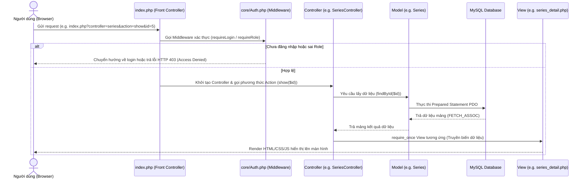

# HƯỚNG DẪN CÀI ĐẶT TRIỂN KHAI & CƠ CHẾ HOẠT ĐỘNG HỆ THỐNG
*Tài liệu hướng dẫn triển khai thực tế và thuyết minh cấu trúc hoạt động phục vụ bảo vệ đồ án*

---

## 1. HƯỚNG DẪN CÀI ĐẶT & TRIỂN KHAI (Installation & Deployment)

Hệ thống được xây dựng trên nền tảng Web PHP thuần (Native PHP) chạy tốt nhất trên môi trường máy chủ cục bộ **XAMPP**.

### Bước 1: Chuẩn bị thư mục dự án
1. Sao chép toàn bộ thư mục mã nguồn vào thư mục root của máy chủ web:
   `C:\xampp\htdocs\Manga-publishing-management-system`

### Bước 2: Thiết lập Cơ sở dữ liệu (Database Setup)
1. Khởi động **Apache** và **MySQL** trên ứng dụng XAMPP Control Panel.
2. Truy cập vào trang quản trị cơ sở dữ liệu: `http://localhost/phpmyadmin/`.
3. Tạo mới một cơ sở dữ liệu trống có tên: `manga_workflow` với đối chiếu (Collation) là `utf8mb4_unicode_ci`.
4. Chọn cơ sở dữ liệu `manga_workflow`, nhấn vào tab **Import** (Nhập), chọn tệp tin SQL tại đường dẫn:
   `database/manga_workflow.sql` trong mã nguồn và nhấn **Import/Go**.

### Bước 3: Cấu hình kết nối Cơ sở dữ liệu
1. Mở file cấu hình kết nối tại: [database.php](file:///d:/XAMPP/htdocs/Manga-publishing-management-system/config/database.php).
2. Kiểm tra các thông số kết nối MySQL cục bộ (thường mặc định trên XAMPP là: Host: `localhost`, Username: `root`, Password: `` (để trống)).

### Bước 4: Khởi chạy và tài khoản Demo
1. Mở trình duyệt web và truy cập đường dẫn:
   `http://localhost/Manga-publishing-management-system/`
2. Đăng nhập hệ thống bằng các tài khoản kiểm thử đã được tạo sẵn trong cơ sở dữ liệu tương ứng với 5 vai trò:

| Vai trò | Tài khoản Đăng nhập | Mật khẩu mặc định | Mục đích demo |
| :--- | :--- | :--- | :--- |
| **Admin** | `admin` | `admin123` | Quản lý tài khoản, phân quyền vai trò. |
| **Mangaka** | `mangaka1` | `password123` | Tạo truyện, chia trang AI, giao việc, duyệt bản thảo của trợ lý. |
| **Assistant** | `assistant1` | `password123` | Xem công việc được giao, nộp file, xem thù lao hàng tháng. |
| **Tantou Editor** | `editor1` | `password123` | Đánh giá chương, viết review, theo dõi tiến độ thời gian thực. |
| **Editorial Board** | `board1` | `password123` | Duyệt xuất bản Series, nhập dữ liệu xếp hạng tuần/tháng. |

---

## 2. KIẾN TRÚC & CƠ CHẾ HOẠT ĐỘNG CỦA MÃ NGUỒN (Request Lifecycle)

Hệ thống hoạt động theo mô hình **MVC** thông qua **Front Controller Pattern** (Mọi yêu cầu đều định tuyến qua tệp tin `index.php` ở root).

### Sơ đồ chu kỳ hoạt động của một Yêu cầu (Request Lifecycle)
Dưới đây là luồng đi của dữ liệu từ khi người dùng click chuột cho đến khi nhận được giao diện:

---

## 3. CẤU TRÚC THƯ MỤC DỰ ÁN (Folder Directory Structure)

Bạn cần giải thích được ý nghĩa các thư mục chính trong cấu trúc dự án:
* **`config/`**: Chứa cấu hình toàn hệ thống (kết nối database, BASE_PATH định nghĩa đường dẫn).
* **`core/`**: Chứa hạt nhân hệ thống bao gồm `Auth.php` (xác thực phân quyền) và `Model.php` (lớp cha kết nối PDO dùng chung thiết kế chia sẻ kết nối Singleton-like).
* **`controllers/`**: Chứa các lớp điều hướng nghiệp vụ. Mỗi thực thể chính có một controller quản lý (Ví dụ: `TaskController` quản lý vòng đời của một công việc).
* **`models/`**: Chứa các lớp tương tác cơ sở dữ liệu tương ứng với từng bảng.
* **`views/`**: Chứa mã giao diện, được chia nhỏ theo vai trò người dùng (thư mục `admin/`, `mangaka/`, `assistant/`, `board/`, `editor/`) và thư mục `layouts/` (Sidebar, Navbar, Header cố định).
* **`uploads/`**: Nơi lưu trữ vật lý các file ảnh bìa truyện (`covers/`), ảnh trang vẽ (`pages/`), và file zip/pdf nộp bài (`submissions/`).

---

## 4. CÁC TỪ KHÓA ĐẮT GIÁ KHI GIẢI THÍCH VỚI GIẢNG VIÊN (Exam Talking Points)

Khi trả lời giảng viên, hãy lồng ghép các thuật ngữ kỹ thuật sau để tăng điểm chuyên môn:

1. **Singleton Connection Sharing (Chia sẻ kết nối tĩnh):**
   * *Giải thích:* Lớp `core/Model.php` sử dụng thuộc tính tĩnh `protected static $sharedConn` giúp tất cả các Model con dùng chung một kết nối MySQL duy nhất trong suốt vòng đời của 1 Request, giảm thiểu tối đa tải kết nối vào MySQL Server.
2. **Dynamic Menu Sidebar (Thanh điều hướng động):**
   * *Giải thích:* Sidebar được cấu trúc động dựa trên quyền hạn người dùng lấy từ Session (`$_SESSION['role_name']`), tự động lọc và vẽ các chức năng được phân quyền thích hợp mà không cần load lại cứng.
3. **Double File Verification (Xác thực tệp tin tải lên hai tầng):**
   * *Giải thích:* Hệ thống không tin tưởng vào phần mở rộng do người dùng gửi lên. Tầng backend sử dụng hàm phân tích nhị phân (Ví dụ: kiểm tra chữ ký định dạng đầu file ZIP là `PK\x03\x04` hoặc file PDF là `%PDF`) để loại trừ mã độc PHP Shell tải lên thư mục upload.
4. **Physical Orphan Cleanup (Dọn dẹp vật lý mồ côi):**
   * *Giải thích:* Mã nguồn tích hợp xử lý sự kiện xóa đối tượng cha sẽ xóa vật lý đối tượng con tương ứng trên ổ cứng thông qua hàm `@unlink`. Tránh rác hệ thống (garbage data) phình to trên máy chủ.
5. **Prepared Statements & Data Typing:**
   * *Giải thích:* Sử dụng cơ chế truyền tham số an toàn trong PDO, ép kiểu biến dữ liệu (`(int)$id`, `intval()`) tại tầng điều hướng để chống lại các lỗ hổng khai thác kiểu biến và SQL Injection.
