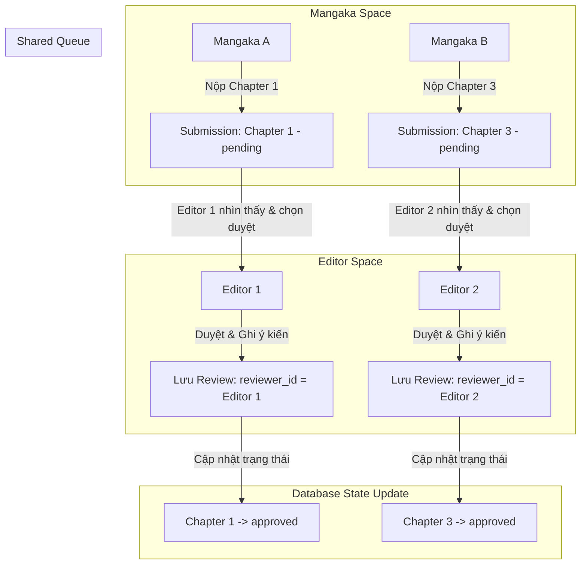

# Phân Tích & Hướng Dẫn Giải Thích Quy Trình Nghiệp Vụ (Workflow) Trong Môi Trường Nhiều Người Dùng

Tài liệu này phân tích cách hệ thống quản lý quy trình sáng tác và xuất bản Manga vận hành khi có nhiều người dùng cùng chia sẻ một vai trò (Admin, Mangaka, Assistant, Tantou Editor, Editorial Board) dựa trên **kiến trúc cơ sở dữ liệu và logic hiện tại của dự án** (không thay đổi Database, Code hay Workflow).

---

## 1. Trách Nhiệm và Phân Quyền các Vai Trò

Dưới đây là mô tả chi tiết nhiệm vụ, phạm vi dữ liệu hiển thị và cơ chế hoạt động của từng vai trò trong hệ thống:

### 👤 Admin (Quản trị viên)
* **Trách nhiệm chính:** Quản lý tài khoản, phân quyền vai trò, giám sát hệ thống.
* **Quyền nhìn thấy dữ liệu:** Toàn bộ dữ liệu hệ thống (bảng `users`, `roles`).
* **Xác định người thực hiện:** Bất kỳ tài khoản Admin nào đăng nhập.
* **Cơ chế tránh xung đột:** Các thao tác cấu hình hệ thống ghi nhận trực tiếp theo session đăng nhập. Sử dụng khóa dòng MySQL khi ghi.

### ✍️ Mangaka (Tác giả chính)
* **Trách nhiệm chính:** Sáng tác truyện, chia nhỏ trang truyện, giao việc cho Assistant, nộp bản thảo hoàn thiện.
* **Quyền nhìn thấy dữ liệu:** Chỉ nhìn thấy các bộ truyện (`series`), chương (`chapters`), và công việc (`tasks`) do chính mình tạo ra (`series.mangaka_id = session.user_id`).
* **Xác định người thực hiện:** Mangaka sở hữu bộ truyện (được đối chiếu qua trường `mangaka_id` của series).
* **Cơ chế tránh xung đột:** Mangaka chỉ thao tác trên bộ truyện của mình. Không thể xem hoặc sửa truyện của Mangaka khác.

### 🎨 Assistant (Trợ lý vẽ)
* **Trách nhiệm chính:** Nhận yêu cầu vẽ nền, đổ tone, hoàn thiện chi tiết trang truyện và nộp lại cho Mangaka.
* **Quyền nhìn thấy dữ liệu:** Chỉ nhìn thấy các công việc (`tasks`) được giao đích danh (`tasks.assistant_id = session.user_id`).
* **Xác định người thực hiện:** Trợ lý được giao nhiệm vụ cụ thể (đối chiếu qua trường `assistant_id` trong bảng `tasks`).
* **Cơ chế tránh xung đột:** Mỗi công việc (`task_id`) chỉ được giao cho duy nhất một Assistant tại một thời điểm.

### 📝 Tantou Editor (Biên tập viên phụ trách)
* **Trách nhiệm chính:** Theo dõi tiến độ của các studio, kiểm duyệt bản thảo chương truyện, đưa ra nhận xét/yêu cầu sửa đổi.
* **Quyền nhìn thấy dữ liệu:** **Shared Queue (Hàng đợi chia sẻ)**: Xem được toàn bộ các bản thảo chương truyện chờ duyệt trên toàn hệ thống (`submissions.chapter_id IS NOT NULL`).
* **Xác định người thực hiện:** Editor thực hiện hành động kiểm duyệt (khi lưu review, ID của họ được lưu vào `reviews.reviewer_id`).
* **Cơ chế tránh xung đột:** Trạng thái bản thảo cập nhật ngay khi được duyệt. Editor sau sẽ thấy trạng thái đã thay đổi và không thể duyệt lại.

### 🏛️ Editorial Board (Hội đồng biên tập)
* **Trách nhiệm chính:** Đánh giá hiệu quả hoạt động, thực hiện xếp hạng định kỳ và đưa ra quyết định xuất bản/hủy bộ truyện.
* **Quyền nhìn thấy dữ liệu:** **Shared Queue (Hàng đợi chia sẻ)**: Xem toàn bộ các bộ truyện và lịch sử xếp hạng để thực hiện đánh giá.
* **Xác định người thực hiện:** Thành viên Hội đồng thực hiện đánh giá (ghi nhận qua trường `series_rankings.board_member_id`).
* **Cơ chế tránh xung đột:** Dữ liệu xếp hạng được lưu theo chu kỳ thời gian cụ thể (tuần/tháng), ngăn việc trùng lặp đánh giá trong cùng một kỳ.

## 2. Phân Tích Chi Tiết Vận Hành Trong Môi Trường Nhiều Người Dùng

Dưới đây là cách hệ thống điều phối công việc khi số lượng người dùng tăng lên:

### 2.1. Vai trò Admin
* **Dữ liệu quyết định quyền nhìn thấy:** Quyền truy cập các route quản trị được bảo vệ bởi Middleware kiểm tra `session.role_name === 'admin'`.
* **Dữ liệu xác định người thực hiện:** Mọi hành động tạo/sửa tài khoản đều thực hiện trực tiếp trên cơ sở dữ liệu.
* **Xử lý xung đột:** Do Admin chỉ thực hiện các tác vụ quản trị tĩnh (như thêm mới user), hệ thống áp dụng cơ chế khóa mức dòng mặc định của MySQL (InnoDB Row Locking) để đảm bảo không ghi đè dữ liệu khi 2 Admin cùng cập nhật thông tin của một người dùng tại một thời điểm.

### 2.2. Vai trò Mangaka (Tác giả chính)
* **Dữ liệu quyết định quyền nhìn thấy:** Khi Mangaka xem danh sách truyện hoặc tạo chương mới, hệ thống truy vấn:
  ```sql
  SELECT * FROM series WHERE mangaka_id = :current_user_id
  ```
  Điều này đảm bảo Mangaka A **hoàn toàn không thấy** các bộ truyện của Mangaka B.
* **Dữ liệu xác định người thực hiện:** Khi tạo bản thảo hoặc giao việc, hệ thống tự động gắn `mangaka_id = session.user_id` vào bản ghi `tasks` hoặc `submissions`.
* **Xử lý xung đột:** Do phân quyền cô lập dữ liệu theo `mangaka_id`, không bao giờ xảy ra xung đột công việc giữa các Mangaka với nhau.

### 2.3. Vai trò Assistant (Trợ lý vẽ)
* **Dữ liệu quyết định quyền nhìn thấy:** Trợ lý chỉ thấy các công việc được giao cho mình thông qua câu lệnh:
  ```sql
  SELECT * FROM tasks WHERE assistant_id = :current_user_id AND status = 'pending'
  ```
* **Dữ liệu xác định người thực hiện:** Khi nộp kết quả công việc, Assistant upload file thông qua form. Hệ thống lưu bản ghi vào bảng `submissions` với:
  ```sql
  INSERT INTO submissions (user_id, task_id, ...) VALUES (:assistant_id, :task_id, ...)
  ```
* **Xử lý xung đột:** Mỗi nhiệm vụ vẽ nền hay đi nét (`task_id`) liên kết với một trang truyện (`page_id`) cụ thể và chỉ trỏ tới duy nhất một `assistant_id`. Do đó, các trợ lý trong cùng studio hoạt động độc lập và không bị chồng chéo công việc của nhau.

### 2.4. Vai trò Tantou Editor (Biên tập viên) và Editorial Board (Hội đồng)
Đây là hai vai trò chạy trên mô hình **Hàng đợi chia sẻ (Shared Queue)**.



#### **Cơ chế hoạt động của Shared Queue đối với Editor:**
1. **Giai đoạn nộp bài:** Mangaka nộp bản thảo chương truyện lên hệ thống. Bản ghi được lưu vào bảng `submissions` với `chapter_id = X` và `status = 'pending'`.
2. **Giai đoạn tiếp nhận:** Bất kỳ Editor nào đăng nhập vào hệ thống đều nhìn thấy danh sách các bản thảo chờ duyệt thông qua câu lệnh:
   ```sql
   SELECT * FROM submissions WHERE chapter_id IS NOT NULL AND status = 'pending'
   ```
3. **Giai đoạn xử lý:** Khi Editor A bấm vào bản thảo của Mangaka X để đánh giá và gửi:
   * Hệ thống tạo một bản ghi trong bảng `reviews` lưu thông tin `reviewer_id = Editor_A_ID`.
   * Đồng thời, trạng thái của submission được cập nhật thành `approved` hoặc `rejected`.
4. **Giải quyết xung đột:** Nếu Editor B cũng đang mở trang duyệt bản thảo đó và bấm gửi sau Editor A:
   * Hệ thống sẽ kiểm tra trạng thái hiện tại của bản thảo. Do Editor A đã đổi trạng thái thành `approved`/`rejected`, hệ thống sẽ chặn không cho Editor B lưu đè hoặc báo lỗi bản thảo đã được xử lý (tránh xung đột dữ liệu).

---

## 3. Đánh Giá Mô Hình Hàng Đợi Chia Sẻ (Shared Queue Model)

Mặc dù mô hình này có vẻ đơn giản, nó mang lại những lợi ích và hạn chế cụ thể cho dự án:

### 3.1. Ưu điểm
* **Tránh nghẽn cổ chai (Bottleneck):** Nếu một Editor bị ốm hoặc bận việc đột xuất, các Editor khác trong tòa soạn vẫn có thể kiểm duyệt và phê duyệt bản thảo để đảm bảo kịp tiến độ in ấn.
* **Tối ưu hóa nguồn lực:** Phù hợp với các tòa soạn manga quy mô vừa và nhỏ, nơi các biên tập viên hỗ trợ lẫn nhau kiểm tra lỗi chính tả, kịch bản hoặc nét vẽ mà không bị bó buộc cứng nhắc.
* **Tối giản hóa kiến trúc phần mềm:** Giúp cấu trúc cơ sở dữ liệu đạt chuẩn 3NF tinh gọn, giảm thiểu các bảng trung gian phân công và các câu lệnh JOIN phức tạp.

### 3.2. Nhược điểm
* **Thiếu tính chuyên môn hóa:** Không hỗ trợ cơ chế gán "Biên tập viên ruột" (Tantou Editor phụ trách độc quyền) cho từng bộ truyện ngay từ đầu.
* **Nguy cơ trùng lặp hành động:** Hai biên tập viên có thể cùng đọc và phân tích một bản thảo cùng một lúc, gây lãng phí thời gian nếu một trong hai người gửi đánh giá trước.

### 3.3. Tính phù hợp với phạm vi đồ án học thuật
Đối với một đồ án tốt nghiệp hoặc đồ án môn học, mô hình Shared Queue hoàn toàn phù hợp và khả thi vì:
1. **Tập trung vào tính năng cốt lõi:** Mục tiêu chính của đồ án là chứng minh luồng đi của dữ liệu từ phác thảo -> vẽ -> duyệt -> xếp hạng hoạt động trơn tru về mặt kỹ thuật, thay vì giải quyết các bài toán quản trị nhân sự phức tạp.
2. **Dễ dàng demo và kiểm thử:** Khi hội đồng chấm thi chạy thử ứng dụng (testing), giảng viên có thể dùng 2 tài khoản Editor khác nhau để duyệt các bản thảo khác nhau một cách linh hoạt mà không cần mất công tạo thêm bước cấu hình gán quyền phức tạp từ Admin.

---

## 4. Định Hướng Phát Triển Tương Lai (Future Improvements)

Để khắc phục nhược điểm của mô hình Shared Queue khi hệ thống phát triển ở quy mô doanh nghiệp lớn, các hướng mở rộng dưới đây được đề xuất phát triển trong các phiên bản tiếp theo:

### 4.1. Cơ chế Gán Biên tập viên phụ trách theo Bộ truyện (Dedicated Tantou Assignment)
* **Giải pháp:** Bổ sung cột `editor_id` vào bảng `series` (khóa ngoại liên kết tới bảng `users`).
* **Luồng chạy mới:** Khi Mangaka nộp chương mới, chỉ Editor được cấu hình trong `series.editor_id` mới nhìn thấy và có quyền phê duyệt bản thảo này.

### 4.2. Cơ chế Tự chọn công việc (Claim / Grab Assignment)
* **Giải pháp:** Khi bản thảo được nộp lên, trạng thái mặc định sẽ là `unassigned`.
* **Luồng chạy mới:** Các Editor sẽ thấy danh sách hàng đợi chung. Họ phải bấm nút "Nhận kiểm duyệt" (Claim) để chuyển trạng thái bản thảo sang `assigned_to = current_editor_id` trước khi tiến hành nhận xét. Điều này ngăn chặn hoàn toàn việc 2 người cùng đọc và duyệt một bản thảo.

---

## 5. Bộ Câu Hỏi & Câu Trả Lời Gợi Ý Khi Bảo Vệ Đồ Án

Dưới đây là các câu hỏi giảng viên thường đặt ra liên quan đến quy trình làm việc nhiều người dùng và cách trả lời tối ưu nhất dựa trên kiến trúc hiện tại:

### **Câu Hỏi 1: Hệ thống của em có nhiều Editor, vậy khi một Mangaka nộp bản thảo, Editor nào sẽ nhận được và duyệt bài?**
> **Trả lời gợi ý:**  
> "Dạ thưa Thầy/Cô, trong kiến trúc hiện tại của đồ án, hệ thống đang áp dụng mô hình **Hàng đợi chia sẻ (Shared Queue)**. Khi Mangaka nộp bản thảo chương truyện, bản thảo này sẽ đi vào một danh sách hàng đợi chung của hệ thống. 
> 
> Tất cả các người dùng có vai trò là Tantou Editor đều có quyền nhìn thấy bản thảo này trong mục 'Chờ kiểm duyệt'. Editor nào rảnh hoặc phụ trách ca trực đó sẽ bấm vào xem chi tiết và thực hiện viết nhận xét, đánh giá. Khi lưu đánh giá, ID của Editor đó được lưu lại làm minh chứng chịu trách nhiệm."

### **Câu Hỏi 2: Nếu hai Editor cùng mở một bản thảo tại một thời điểm và cùng bấm duyệt thì có xảy ra lỗi xung đột dữ liệu (data conflict) hay không?**
> **Trả lời gợi ý:**  
> "Dạ, hệ thống đã phòng ngừa xung đột này ở cả mức Logic Nghiệp vụ (Application Level) và Cơ sở dữ liệu (Database Level):
> 
> * **Về mặt Logic:** Khi Editor đầu tiên gửi đánh giá, trạng thái của bản thảo (`submission status`) sẽ lập tức chuyển từ `pending` sang `approved` hoặc `rejected`. Khi Editor thứ hai bấm gửi ngay sau đó, Controller của hệ thống sẽ kiểm tra lại trạng thái hiện tại trong DB. Nếu thấy trạng thái không còn là `pending`, hệ thống sẽ chặn hành động lưu đè và hiển thị thông báo lỗi: *'Bản thảo này đã được kiểm duyệt bởi người khác'* để đảm bảo tính nhất quán dữ liệu.
> * **Về mặt CSDL:** Bảng `reviews` lưu trữ mỗi lượt review là một dòng mới độc lập với khóa ngoại trỏ tới `submission_id`, và bảng `submissions` sử dụng cơ chế khóa dòng (Row-level locking) của công cụ lưu trữ InnoDB khi thực hiện câu lệnh UPDATE, tránh việc ghi đè đồng thời."

### **Câu Hỏi 3: Tại sao em không thiết kế gán cứng một Biên tập viên phụ trách riêng cho từng Bộ truyện (Series) ngay từ đầu để chuyên môn hóa công việc?**
> **Trả lời gợi ý:**  
> "Dạ, việc thiết kế gán cứng Biên tập viên phụ trách (Tantou Editor) cho từng Series là một hướng đi rất thực tế. Tuy nhiên, trong phạm vi của đồ án này, em ưu tiên xây dựng mô hình **Hàng đợi chia sẻ (Shared Queue)** vì các lý do sau:
> 
> 1. **Tính linh hoạt cao:** Tránh việc bản thảo bị tồn đọng khi biên tập viên được gán bị quá tải hoặc vắng mặt, đảm bảo mạch truyện không bị gián đoạn.
> 2. **Tối giản hóa luồng demo:** Giúp quá trình trình bày đồ án diễn ra nhanh chóng, giám khảo có thể dễ dàng kiểm thử toàn bộ tính năng kiểm duyệt bằng bất kỳ tài khoản Editor nào có sẵn mà không cần thêm bước phân công thủ công phức tạp.
> 
> Tuy nhiên, cấu trúc dữ liệu hiện tại của em đạt chuẩn 3NF nên rất dễ dàng mở rộng. Trong tương lai, em hoàn toàn có thể bổ sung thêm trường `editor_id` vào bảng `series` để chuyển sang mô hình phân công độc quyền mà không làm phá vỡ cấu trúc của các bảng khác."
